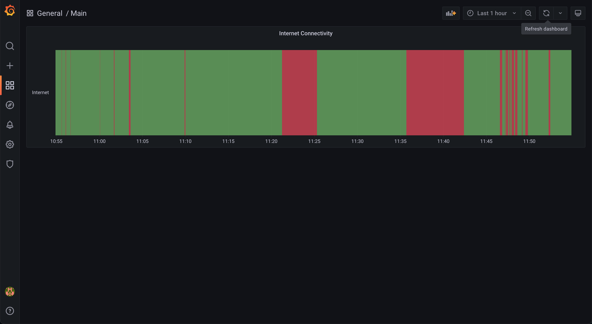

# internet-connectivity

This is a small program to monitor an internet connection and visualise it using [Grafana](https://grafana.com/).



## Set Up

These steps are for running it on a Raspberry Pi 4B (64-bit OS), so they may need to be adapted for other systems.

```bash
# make a public directory and CSV file, used by ./internet.sh
mkdir -p /public
touch /public/internet-log.csv
chmod -R 777 /public/internet-log.csv

# install Grafana
# see https://grafana.com/tutorials/install-grafana-on-raspberry-pi/ for more info
wget -q -O - https://packages.grafana.com/gpg.key | sudo apt-key add -
echo "deb https://packages.grafana.com/oss/deb stable main" | sudo tee -a /etc/apt/sources.list.d/grafana.list
sudo apt-get update
sudo apt-get install -y grafana

# start Grafana (on port 3000)
sudo systemctl daemon-reload
sudo systemctl enable grafana-server
sudo systemctl start grafana-server

# switch to the `grafana` user with `sudo -u grafana -s`
/usr/share/grafana/bin/grafana-cli plugins install marcusolsson-csv-datasource

# restart grafana
sudo systemctl restart grafana-server
```

Now there are a few edits to the config file at `/etc/grafana/grafana.ini`.
Note that the file can only be edited with `sudo`.

* Set `default_home_dashboard_path` to `"/public/Main.json"`
* Set `allow_sign_up` and `allow_org_create` to `false`
* In `[auth.anonymous]`, set `enabled` to `true` and `hide_version` to `true`
* Add this entry to the bottom ([ref](https://marcus.se.net/grafana-csv-datasource/configuration)):
    ```ini
    [plugin.marcusolsson-csv-datasource]
    allow_local_mode = true
    ```

After restarting Grafana, you can then add a CSV data
source (pointing to `/public/internet-log.csv`).
The `Main.json` file from this repo needs to be
copied to `/public/Main.json`.

Notes:
* to run the logging script, start a `tmux` session by
    running `tmux`, then start the script, followed by Ctrl-b, d to detach.
* to get Unix timestamps to work in Grafana, you need to use the "Transform" menu.
    Use "Add field from calculation" with a "Binary operation" to multiply, followed by a "Convert field type" to make it a "Time" field.

## References

* <https://marcus.se.net/grafana-csv-datasource/>
* <https://stackoverflow.com/questions/921398/exit-status-of-ping-command>
* <https://github.com/grafana/grafana/issues/24917>
* <https://github.com/grafana/grafana/issues/6297>
* <https://community.grafana.com/t/how-to-configure-default-home-dashboard-path/41661>
* <https://grafana.com/docs/grafana/v7.5/administration/preferences/change-home-dashboard/>
* <https://www.reddit.com/r/grafana/comments/lm1y9k/how_do_i_give_grafana_access_to_local_csv_file_if/>
